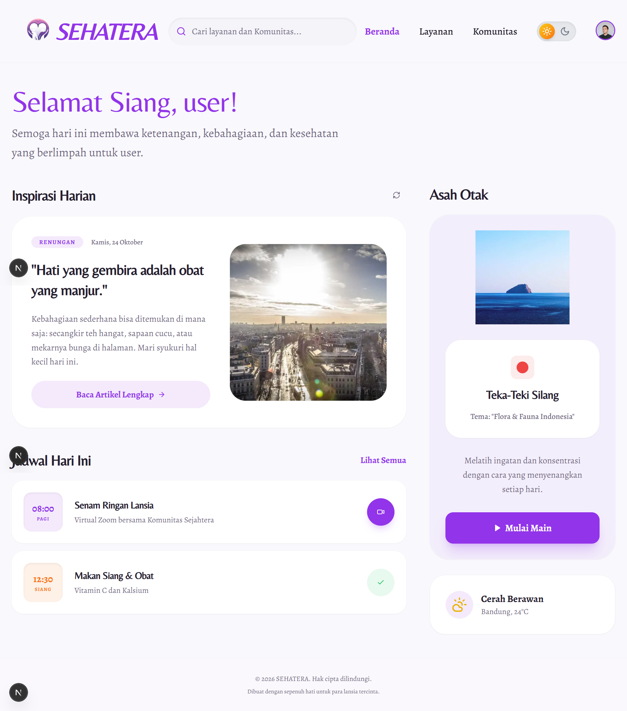
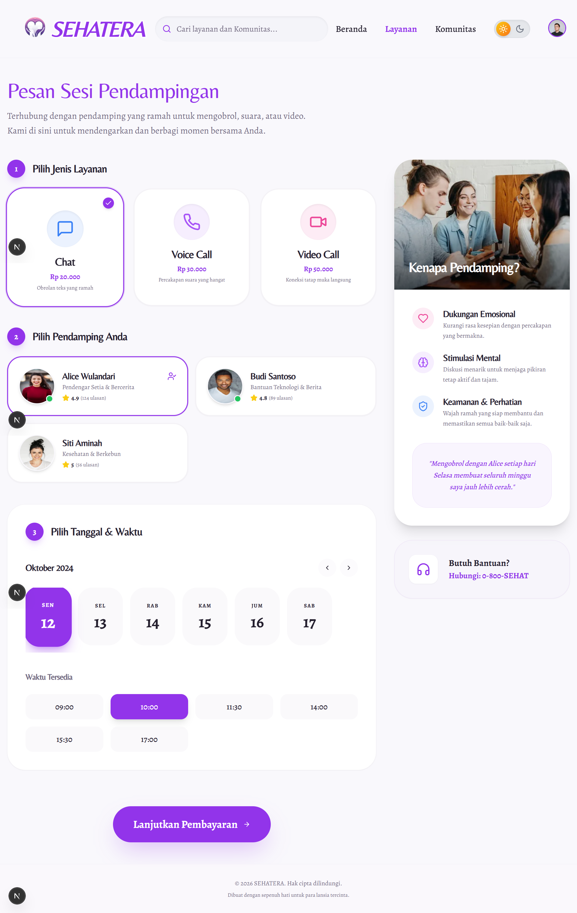
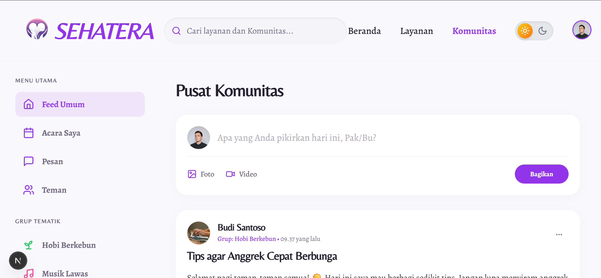
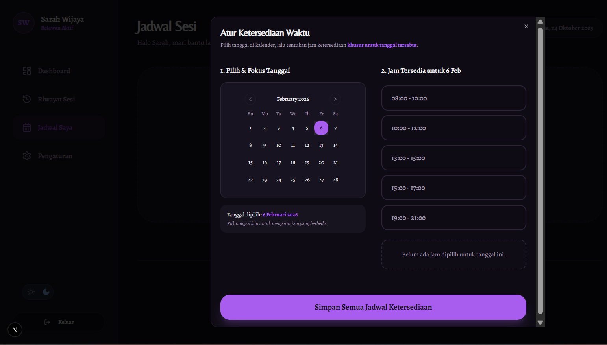
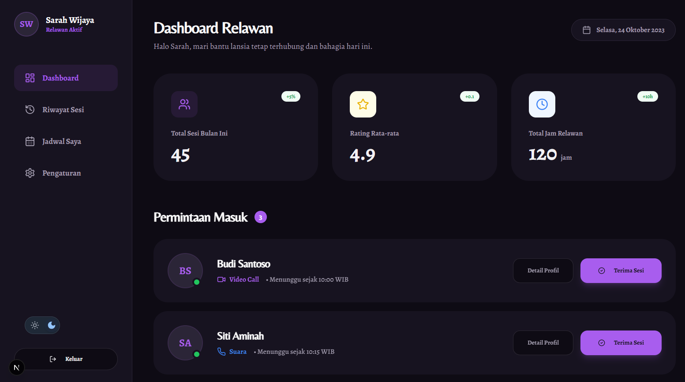
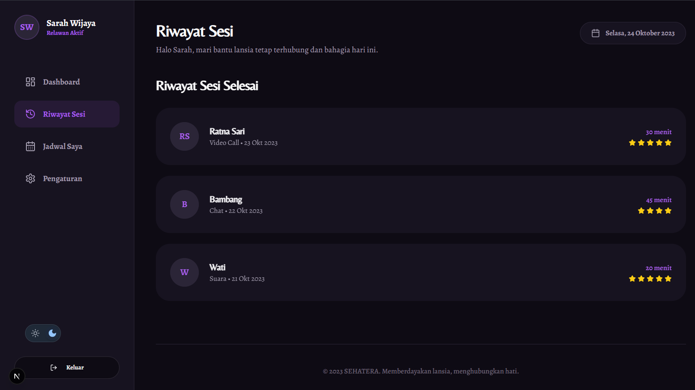

  

<h1 align="center">🌿 SEHATERA</h1>

  <strong>Social & Emotional Health Assistant for Elderly</strong> 
  AI-Powered Elderly Companion Platform (Prototype)

  Prototipe platform pendampingan sosial lansia berbasis komunitas, relawan, dan kecerdasan buatan 
  yang dikembangkan dalam rangka Program <strong>P2MW</strong>.

  
  
  
  
  
  
  

  📄 <a href="#-deskripsi-proyek">Deskripsi</a> •
  ✨ <a href="#-fitur-utama">Fitur</a> •
  👥 <a href="#-peran-pengguna">Pengguna</a> •
  🧠 <a href="#-catatan-penting-disclaimer">Disclaimer</a>

---

## 📝 Deskripsi Proyek

**SEHATERA** adalah sebuah **platform prototipe pendampingan sosial bagi lansia** yang dirancang untuk membantu
mengurangi rasa kesepian, menjaga kesehatan mental, serta meningkatkan kualitas hidup lansia melalui
interaksi komunitas, pendampingan relawan, dan konten berbasis **Artificial Intelligence (AI)**.

Proyek ini dikembangkan sebagai bagian dari **Program Pembinaan Mahasiswa Wirausaha (P2MW)** dan
berfokus pada eksplorasi solusi digital di bidang **kesehatan sosial dan emosional lansia**.
SEHATERA **bukan produk komersial**, melainkan **prototipe konseptual** untuk kebutuhan kompetisi dan pengembangan ide.

---

## ✨ Fitur Utama

### 🏠 Beranda Lansia
Menampilkan ringkasan layanan utama, konten harian, serta akses cepat ke fitur komunitas dan pendampingan.

---

### 🧠 AI Curated Content
Konten harian berupa:
- Artikel ringan
- Kutipan inspiratif
- Rekomendasi berbasis minat & suasana hati

Konten dihasilkan secara otomatis menggunakan **Gemini AI**.

---

### 🧩 Daily Brain Training
Fitur latihan otak harian seperti:
- Puzzle
- Kuis ringan

Bertujuan menjaga daya ingat dan konsentrasi lansia secara menyenangkan.

---

### 👥 Community Hub
Forum dan grup berbasis minat, seperti:
- Berkebun
- Musik lawas
- Cerita pengalaman hidup

Mendorong interaksi sosial antar lansia.

---

### 📅 Session Booking & Scheduling
Lansia dapat memesan sesi pendampingan dengan relawan melalui:
- Chat
- Voice Call
- Video Call

---

### 💳 Payment Gateway Simulation
Simulasi proses checkout layanan pendampingan menggunakan:
- QRIS
- Transfer Bank

⚠️ **Bersifat simulasi, tidak terhubung ke sistem pembayaran nyata.**

---

### ♿ Accessibility Settings
Penyesuaian antarmuka khusus lansia:
- Ukuran teks (font size)
- Mode Gelap (Dark Mode)
- Kontras warna ramah mata

---

## 👥 Peran Pengguna

### 👴 Lansia (Elderly)
- Mengakses konten harian berbasis AI
- Mengikuti komunitas
- Bermain puzzle
- Memesan sesi pendampingan dengan relawan

---

### 🧑‍🤝‍🧑 Relawan (Volunteer)
- Mengelola permintaan sesi masuk
- Mengatur jadwal ketersediaan
- Memberikan dukungan emosional kepada lansia

---

### 📋 Riwayat & Manajemen Sesi
Relawan dapat memantau histori pendampingan yang telah dilakukan.

---

### ⚙️ Pengaturan Akun Relawan
Manajemen profil dan preferensi relawan.

---

## 👨‍💻 Tim Pengembang

Mahasiswa **Program Studi Teknik Informatika**  
**Universitas Sam Ratulangi**

- **ALIF FIRDAUS PUTRA MALLYSA**
- **BRANDO MATHIAS ZUSRIADI**
- **PHILIA SLAVKA EUNIKE MAILANGKAY**
- **SYIFABELA SURATINOYO**

---

## ⚠️ Catatan Penting (Disclaimer)

🚨 **APLIKASI INI MERUPAKAN PROTOTIPE**

SEHATERA dikembangkan **khusus untuk keperluan P2MW dan akademik**.

- Tidak terintegrasi dengan sistem layanan kesehatan resmi
- Tidak digunakan untuk layanan medis atau psikologis nyata
- Seluruh data bersifat simulasi

---

## 🎯 Tujuan Pengembangan

- Menghadirkan solusi digital untuk kesejahteraan lansia
- Mengurangi isolasi sosial pada usia lanjut
- Menjadi model awal pengembangan platform pendampingan lansia
- Mendukung inovasi mahasiswa dalam program P2MW

---

  💚 <strong>Made with Care for Elderly Well-Being</strong>  
  Dikembangkan sebagai <strong>Prototype P2MW</strong> oleh Mahasiswa Teknik Informatika 
  Universitas Sam Ratulangi

  © 2025 SEHATERA — Academic Prototype Only

